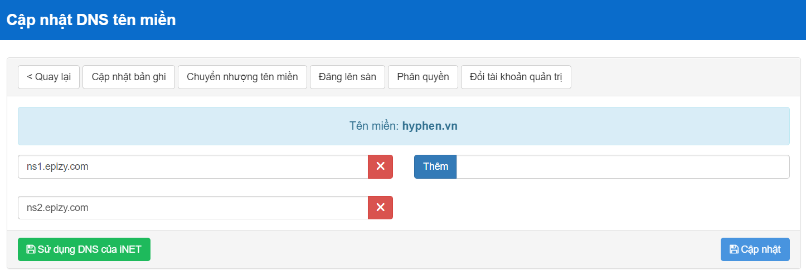
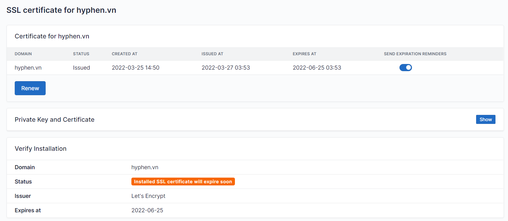

# Hyphen Deployment

## Table of contents

- [Frontend Deployment](#frontend-deployment)
  - Source code
  - Web hosting
  - Domain name & SSL
- [Backend Deployment](#backend-deployment)
  - Source code
  - Hosting with domain name
  - Future

## Frontend Deployment

### [Source code](https://github.com/dgbttn/hyphen-frontend)

_Private repo. Contact để được add account._

Frontend đang được viết và build bằng [AngularJS](https://angular.io/cli).

### Web hosting

Web sau khi build đang được host ở [InfinityFree](https://app.infinityfree.net/). _Contact để nhận account._

### Domain name & SSL

Team đã đăng ký tên miền hyphen.vn trên [iNET](inet.vn), sau đó trỏ DNS về server của InfinityFree để resolve tên miền thành công.

Để lên `https`, cài đặt SSL certificate và thêm CNAME record theo hướng dẫn:

- https://forum.infinityfree.net/docs?topic=49324#if-you-already-have-a-private-key-2
- https://forum.infinityfree.net/docs?topic=49321

## Backend Deployment

### Source code

Hiện tại, source code đang được lưu trên máy của anh [Tùng (ĐV)](https://www.facebook.com/100010047396090). Source code bao gồm:

- Python code Flask app
- Các ML models

Để access vào máy chứa source code back-end, team đang sử dụng [AnyDesk](https://anydesk.com). Contact để nhận code.

Source code (không bao gồm models) có thể được cập nhật lên [repo này](https://github.com/tranbaohieu/hyphen) _(private repo, contact để được add account)_.

### Hosting with domain name

Trước đây, dynamic IP address của máy anh Tùng được Điệp deploy lên [noip.com](noip.com) với tên miền `dipe.ddns.net`, bằng account của Điệp. Backend server được chạy ở port _8081_, tức là bên ngoài gọi tới server bằng URL `http://dipe.ddns.net:8081`.

Hiện tại, Điệp hầu như inactive nên chưa thể custom hay thay đổi gì thêm cho URL này. Cần deploy server lên `https` để tránh [strict-origin-when-cross-origin](https://developer.chrome.com/blog/referrer-policy-new-chrome-default/), nên đang sử dụng 1 proxy bằng Flask, host bằng [NGINX](https://www.nginx.com/) + SSL (adhoc) trên Amazon EC2, và trỏ tới tên miền `hyphen.khoivn.tech` (liên hệ anh Khôi). Proxy này có tác dụng hứng mọi request tới `https://hyphen.khoivn.tech` rồi forward sang `http://dipe.ddns.net:8081`, sau đó nhận response và trả về.

### Future

_Cần discuss thêm._

- Trước mắt nên host Flask server ở 1 nơi và loại bỏ proxy.
- Tự chủ tên miền.
